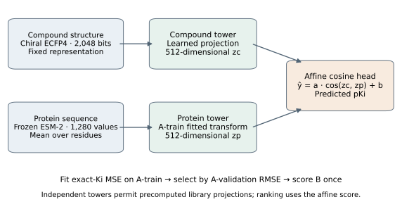
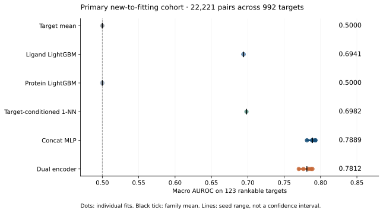

# Seq2Lead

**Scientific software for protein-sequence-based prioritisation of compounds from an existing library.**

Given one protein sequence and a frozen library of compounds that already exist,
Seq2Lead orders that library by predicted pKi so a limited number can be taken
forward first. It prioritises existing compounds — it does not design or generate
molecules, and a predicted ranking is a triage hypothesis, not evidence of binding.

Prioritisation is only useful if the ranking can be trusted, so the evaluation is
treated as the hard part. The pipeline keeps raw evidence, records which dated
release every measurement came from, keeps exact and censored measurements apart,
and refuses to publish a metric whose inputs it cannot re-verify.

**What this is today: a local prototype with an auditable benchmark of it.**
It runs as a command line and, since v0.2, as a browser interface served from your
own machine over a localhost-only HTTP API. There is no hosted service, no account,
no upload and no public endpoint: the server binds to the loopback address and
refuses anything else. The benchmark is a historical January → September 2026
BindingDB evaluation whose predictions, labels, provenance and verification records
are published so the reported numbers can be recomputed independently. The benchmark
is the contribution; the prototype is what it measures.

Results are **exploratory**. Ki pooling across assay contexts is provisional, the
prospective confirmatory freeze is unsigned, and no paper has been submitted or
peer reviewed.

## Architecture



Two independent towers project a 2,048-bit chiral ECFP4 fingerprint and a frozen
ESM-2 embedding into a shared 512-dimensional space; an affine map on their cosine
similarity gives a score in pKi units. Because the towers are independent, compound
projections can be computed once and reused across sequence queries.

Compounds use chiral ECFP4, 2,048 logical bits stored as 256 packed bytes. Proteins
use revision-pinned ESM-2 t33 650M, mean-pooled over residues excluding special
tokens; embeddings beyond the 1,022-residue training window are flagged as
provisional. Features are keyed by the content they were computed from, so a cache
cannot be silently substituted.

## Key results

| Evaluation | Observed result | How to read it |
| --- | --- | --- |
| Historical Jan → Sep 2026, pairs new to fitting | Concat-MLP macro AUROC 0.788873; dual encoder 0.781229 | No demonstrated dual-encoder improvement. No equivalence or significance claim; no paired target-level interval was computed |
| Headline coverage | 22,221 pairs over 992 targets; **123** clear ≥5 actives and ≥5 inactives | The macro metrics describe the rankable minority, not all targets |
| Target-conditioned ligand 1-NN | 0.964204 on recurrent pairs; 0.668510 on pairs absent from the earlier release | A contrast between two different populations, not a measured effect of recurrence |
| Separate docking assessment (carbonic anhydrase 2) | AUROC 0.624060 against a pre-registered 0.70 gate: **FAIL** | This protocol and cohort fail the standalone ranking requirement; both sensitivity boxes also failed |
| Known-pose recovery | 1.514 Å RMSD | Recovering a crystal pose and ranking affinity are different tests |



Seed ranges in the figures are training variation, **not** confidence intervals.

Full numbers and denominators: [M11h report](reports/m11h_results.md) ·
[baseline leaderboard](reports/leaderboard.md) · [figure scope](paper/FIGURES.md).

## Three ways to run it

| Mode | From a clone? | Needs |
| --- | --- | --- |
| **Saved-prediction reproduction** — recompute the published metrics | **yes** | tracked files only |
| **Live sequence-query ranking** — `seq2lead prioritise` on a new sequence | **in v0.2**, with one download | an inference bundle (59 MiB) plus ESM-2 weights. No database — see [standalone ranking](docs/STANDALONE.md) |
| **Raw-to-fit rebuild** — ingest and refit end to end | **no** | raw archives, databases, full intermediate set |

Definitions and measured artifact sizes: [release scope](docs/RELEASE_SCOPE.md).
The full local test suite is none of the three — it checks the software, not the
science.

### Quick start — saved-prediction reproduction

Nothing to download. Python 3.11, environment pinned in `uv.lock`.

```bash
uv sync --all-groups
uv run python -m seq2lead.asof.verify_results data/asof/m11h/run-20261005T134842Z
```

This verifies the saved predictions, the evaluation table and the published results
**without fitting anything**. Checks it cannot perform are reported as unavailable
rather than passed — in a published copy the model checkpoints and the training
membership export are absent.

The full scoring and publication sequence writes derived files, so use a disposable
clone to leave the reviewed copy untouched:

```bash
uv run python -m seq2lead.asof.recompute       data/asof/m11h/run-20261005T134842Z
uv run python -m seq2lead.asof.verify_results  data/asof/m11h/run-20261005T134842Z
uv run python -m seq2lead.asof.publish         data/asof/m11h/run-20261005T134842Z
```

The three stages are separate on purpose: publication refuses a verification record
that is not bound to the inputs as they currently stand. Read-only from Python:

```python
from seq2lead.asof.verify_results import verify

verdict = verify("data/asof/m11h/run-20261005T134842Z")
print(verdict["passed"], verdict["checks_not_performed"])
```

### Live-ranking prerequisites

**In v0.2 this works without a database**, from an inference bundle:

```bash
uv run seq2lead prioritise --bundle ./seq2lead-bundle --sequence-file reports/examples/query_target.fasta --top-n 50
```

Install and bundle download, pinned to the release:

```bash
git clone --branch v0.2.0 https://github.com/rinatrizvanov/seq2lead.git
cd seq2lead
uv sync --all-groups
curl -LO https://github.com/rinatrizvanov/seq2lead/releases/download/v0.2.0/seq2lead-inference-bundle-v1.tar.gz
tar -xzf seq2lead-inference-bundle-v1.tar.gz
mv seq2lead-inference-bundle-v1 seq2lead-bundle
uv run seq2lead bundle verify --bundle ./seq2lead-bundle
```

It needs the bundle (59 MiB of precomputed compound projections and model
pieces, distributed separately from the source) and the revision-pinned ESM-2
weights (2.43 GiB, downloaded once on your first query, never redistributed).
Nothing else: no
PostgreSQL, no feature caches, no upload. Full detail, measured costs and the
optional shortlisting are in [standalone ranking](docs/STANDALONE.md).

#### What the bundled library is

The bundle carries one frozen library, `curated-ki-25k-v1`. Its membership rule is
exact and worth stating before you read a ranking:

> every compound with **at least one exact-relation (`=`) Ki measurement** in the
> pinned BindingDB source release, **ordered by ascending internal compound id**,
> **capped at the first 25,000**.

**That is a deterministic prefix, not a representative sample.** 232,721 compounds
in the curated database satisfy the eligibility condition; the library is the first
25,000 of them in id order. The id is a surrogate key that roughly tracks when a
compound entered the database, so the prefix is not random, not stratified, not
drug-like-filtered and not chosen for diversity or for relevance to your query.
Re-running the rule reproduces the same 25,000 every time, which is why it is used —
reproducibility, not representativeness. Membership means only that *somebody*
measured a Ki for that compound against *some* protein. It says nothing about your
protein, and nothing about whether the compound is a drug, approved or safe. The
full accounting is in [standalone ranking](docs/STANDALONE.md#the-bundled-library-what-it-is-and-is-not).

#### Preparing a database is a different job from running inference

These are two separate paths and only the first is needed to rank a sequence:

| | **Standalone inference** (v0.2) | **Database preparation** |
| --- | --- | --- |
| Commands | `seq2lead prioritise`, `seq2lead web` | `seq2lead ingest`, `curate`, `endpoint build`, `split build`, `features build` |
| Needs | the 59 MiB bundle and ESM-2 weights | raw BindingDB archives, PostgreSQL, feature caches, hours of compute |
| Library | fixed at the bundled 25,000 | whatever you curate |
| Why you would | rank a sequence | rebuild or extend the benchmark, or change the library |

Standalone inference reads only precomputed compound projections, so RDKit,
PostgreSQL and the fingerprint caches are not in its path at all. `seq2lead rank`,
the original database-backed path, still exists and needs the local corpus and the
bound feature caches — see the [demo guide](docs/DEMO.md). A recorded example output
is at `reports/examples/rank_demo.txt`.

### The local browser interface

```bash
uv run seq2lead web --bundle ./seq2lead-bundle
```

It serves `http://127.0.0.1:8765` and calls the same inference code as the CLI; the
tests assert the rows it returns match `seq2lead.inference.rank` exactly. How it
behaves:

- **The model loads once.** ESM-2 is loaded on the first query and kept in memory
  for the life of the process, so the first ranking pays the load and later ones do
  not. `--preload` moves that cost to startup instead. The status line at the top of
  the page says which state the encoder is in.
- **Queries run one at a time.** A single worker serializes jobs against the one
  loaded encoder; a second request queues and the page shows its position. This is a
  single-user local tool — there is no authentication, no TLS and no rate limiting.
- **A running query can be cancelled.** Cancellation is cooperative: the job stops
  at its next checkpoint, returns no partial ranking, and the server and queue stay
  usable afterwards.
- **Results export as CSV**, byte-identical to the CSV the CLI writes, including the
  framing comments. Compound identifiers can be copied as a list, and any single
  compound's full SMILES can be copied from its detail panel.
- **The library browser's search is a substring match** over the compound identifier
  and over the SMILES *text*. It is not a structure, substructure or similarity
  search: searching `OCCCCC` finds SMILES strings that literally contain those
  characters, which is not the same as the compounds containing that group.

#### Candidate pool and shortlist are two different numbers

Every compound in the library is always scored. Two separate settings then decide
what you see, and conflating them is the easiest way to misread a result:

| | What it does |
| --- | --- |
| **Candidate pool** (`--top-n`, "Candidate pool" in the browser) | how many of the scored rows are kept and returned, best first |
| **Shortlist** (property filters, diversity) | a *view* over those kept rows |

**Filters and diversity currently operate within the candidate pool, not over the
whole library.** Asking for a molecular-weight window with a pool of 50 filters
those 50 rows; it does not search the other 24,950 compounds for ones that match.
If you want filtering to range more widely, raise the pool first. Shortlisting never
re-scores and never re-orders: the unfiltered rank and score stay on every row, and
removed rows are reported with the reason they were removed.

Predicted pKi is neither a calibrated probability nor proof of binding.

## Limitations

- **Exploratory, not confirmatory.** The later snapshot's labels and the earlier
  results were inspected before the historical study ran, and the prospective
  freeze is unsigned.
- **The macro metrics cover a minority of targets** — 123 of 992.
- **Ki poolability across assay contexts is unresolved**; every count assumes the
  current pooling rule.
- **Declared but unbuilt**: the retrieval layer, evaluation-mode evidence display,
  and scoring of the `label_reversal` split. Calibration was not computed, so
  outputs are ranking scores only.
- **A raw-to-fit rebuild is not independently reproducible.** The September
  snapshot is a rolling monthly BindingDB release that is not archived at a stable
  URL, so the exact bytes may be unobtainable; the pinned digest detects a
  substitution rather than tolerating one.
- **No prospective validation and no external-method comparison** were performed.
- AI coding and review assistants were used extensively in implementation,
  auditing and drafting. The author is responsible for the code, evidence and
  interpretation.

Measurement types are retained separately; regression targets use exact Ki alone,
and decisive censored evidence supplies ranking classes but never a point value.
Primary activity is pKi ≥ 6.0. Discordance and contradiction are represented
explicitly rather than averaged away. Snapshot A is the 2026-01-01 archival
deposit, DOI [10.6075/J0V40W61](https://doi.org/10.6075/J0V40W61); snapshot B is
the pinned BindingDB 202609 release.

## Development

```bash
uv run ruff check .
uv run ruff format --check .
uv run pytest
```

With a database:

```bash
cp .env.example .env
docker compose --env-file .env -f docker/compose.yml up -d
uv run seq2lead db migrate && uv run seq2lead db ping
```

The full suite needs the complete local artifact set; 16 files cannot run from a
clone because a checkout does not carry their artifacts. CI runs the portable
subset and names what it skipped — [CI scope](docs/CI_SCOPE.md).

## Documentation

- [Release scope](docs/RELEASE_SCOPE.md) — the three run modes, and what each one establishes.
- [Reproduction guide](docs/REPRODUCIBILITY.md) — commands and per-check availability.
- [Standalone ranking](docs/STANDALONE.md) — **v0.2**: rank a bundled library from one sequence, no database, CLI or local browser interface.
- [Demo guide](docs/DEMO.md) — the database-backed ranking path and evidence modes.
- [Evaluation](docs/EVALUATION.md) · [Splits](docs/SPLITS.md) · [Features](docs/FEATURES.md) · [Schema](docs/SCHEMA.md) · [Docking](docs/DOCKING.md) — method detail.
- [Related work](docs/RELATED_WORK.md) — comparison with the nearest prior work, and what is not claimed.
- [Roadmap](docs/ROADMAP.md) — what is built, what is declared but unbuilt.
- [Attribution and licensing](docs/ATTRIBUTION.md) — row-level provenance for every shipped data file.
- [CI scope](docs/CI_SCOPE.md) — what a green run does and does not establish.
- [Documentation archive](docs/archive/README.md) — provenance records, plus why the two frozen protocol documents stay in place.
- [Manuscript](paper/manuscript.md) — draft technical report; [Word version](paper/Seq2Lead_scientific_manuscript.docx). Not submitted or peer reviewed.

## Licences

Two licences are in effect, deliberately separate:

- `LICENSE` — MIT, covering the **project code only**.
- `DATA_LICENSE` — the shipped data, assigned per file from BindingDB's own
  row-level source column: CC BY 3.0 for BindingDB-curated rows, CC BY-SA 3.0
  Unported for rows BindingDB imported from ChEMBL. Full texts in `licenses/`.

Share-alike applies to the ChEMBL-derived data and does not reach the code, which
is independently authored software that reads the data rather than an adaptation of
it. Two model-derived artifacts ship under CC BY-SA 3.0 as a conservative choice;
whether a fitted statistic is an "Adaptation" is not decided here. ESM-2's weights
are MIT-declared at the pinned revision but are not redistributed, and MIT does not
speak to model outputs. Per-file assignments and the reasoning are in
[attribution and licensing](docs/ATTRIBUTION.md) and `DATA_LICENSE`.

Required attribution when redistributing any shipped data file: BindingDB (Liu et
al., *Nucleic Acids Research* 2025;53:D1633–D1644), the archival deposit DOI, the
pinned 202609 release, ChEMBL under CC BY-SA 3.0, and ESM-2 at its pinned revision.
